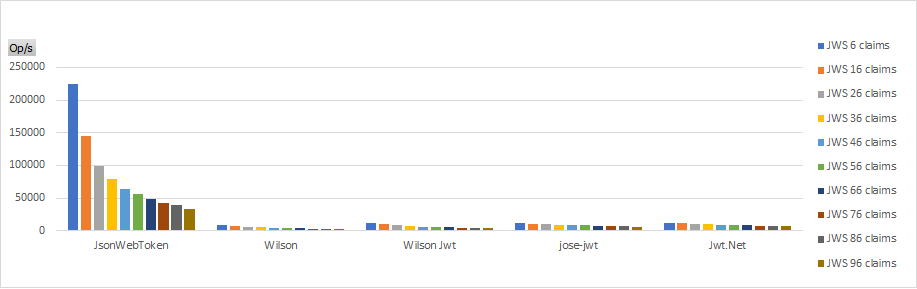
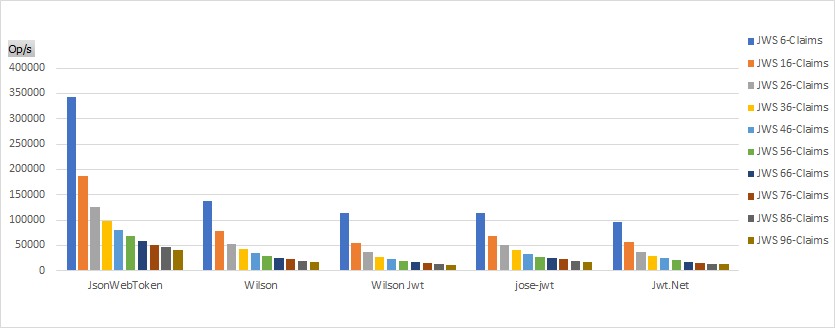
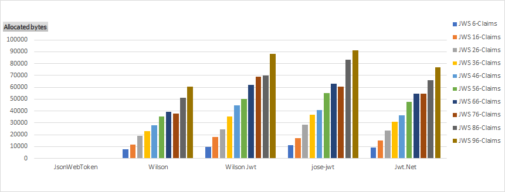
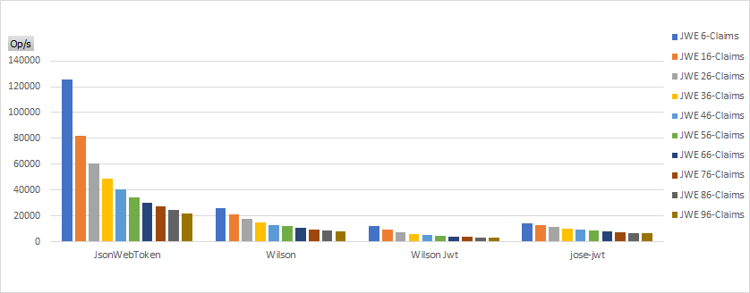

## Read & validate token benchmarks
Token validation includes:
* signature verification
* expiration time 
* issuer presence & validity
* audience presence & validity

Tokens used in this benchmarks have from 6 to 96 claims.

**Note:** JsonWebToken, Wilson & Wilson JWT propose signature and standard claims validation. Jwt.Net only propose signature validation. jose-jwt does not propose any validation.

### Read & validate signed JWT (HS256)

*JWS validation, operation per second. Higher is better.*

*JWS validation, allocated bytes per operation. Lower is better.*

### Read & validate encrypted JWT (A128CBC-HS256 & A128KW, with HS256 signed JWT)

*JWE validation, operation per second. Higher is better.*

*JWE validation, allocated bytes per operation. Lower is better.*

### Read & validate encrypted and compressed JWT (A128CBC-HS256 & A128KW, with HS256 signed JWT, deflate compression)

*JWE compressed validation, operation per second. Higher is better.*

*JWE compressed validation, allocated bytes per operation. Lower is better.*

### Read & validate invalid JWT
Token is invalid due to the invalid signature. 

*Invalid JWS validation, operation per second. Higher is better.*

*Invalid JWS validation, allocated bytes per operation. Lower is better.*
*JsonWebToken allocation is too low compared to others libraries to be represented in this graph.*

## Write token benchmarks
Tokens used in this benchmarks have from 6 to 96 claims.

### Write signed JWT (HS256)

*JWS creation, operation per second. Higher is better.*

*JWS creation, allocated bytes per operation. Lower is better.*
*JsonWebToken allocation is too low compared to others libraries to be represented in this graph.*

### Write encrypted JWT (A128CBC-HS256 & A128KW, with HS256 signed JWT)

_JWE creation, operation per second. Higher is better._

_JWE creation, allocated bytes per operation. Lower is better._
*JsonWebToken allocation is too low compared to others libraries to be represented in this graph.*

### Write encrypted and compressed JWT (A128CBC-HS256 & A128KW, with HS256 signed JWT, deflate compression)

*JWE compressed creation, operation per second. Higher is better.*

*JWE compressed creation, allocated bytes per operation. Lower is better.*

## Versions used
JsonWebToken was tested in version 1.0.0.
https://www.nuget.org/packages/JsonWebToken/1.0.0

Wilson was tested in version 5.6.0.
https://www.nuget.org/packages/System.IdentityModel.Tokens.Jwt/5.6.0

Wilson JWT was tested in version 5.6.0.
https://www.nuget.org/packages/Microsoft.IdentityModel.JsonWebTokens/5.6.0

Jwt.Net was tested in version 5.3.1.
https://www.nuget.org/packages/JWT/5.3.1

jose-jwt was tested in version 2.5.0.
https://www.nuget.org/packages/jose-jwt/2.5.0
